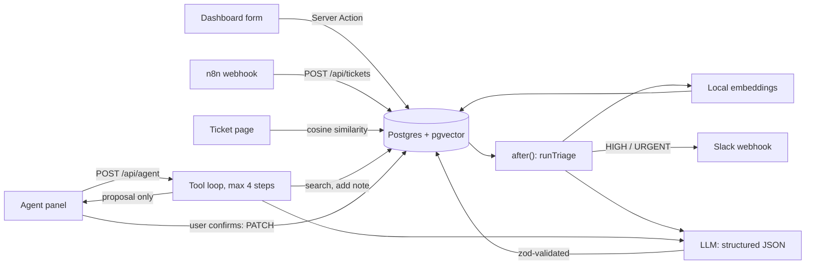

# Architecture

## Flow

## Key decisions

**Background triage with `after()`.** Ticket creation returns immediately; triage runs after the response. If the AI fails, the ticket is marked `FAILED` and stays usable, with a retry button. Triage and embedding never throw into the request path.

**Schema-validated output.** The model is asked for JSON matching a schema derived from the same `zod` schema used to validate the response. Anything that fails validation is treated as a failure rather than trusted.

**Agent with a narrow tool surface.** Three tools, all scoped to the current ticket. The server supplies the ticket id; the model cannot target another ticket. `update_status` returns a proposal and the UI performs the write through the existing `PATCH` route only after the user confirms.

**Prompt injection posture.** Ticket text and notes are untrusted. System prompts say so, tool arguments are validated, the blast radius is limited (no destructive tools, status changes need confirmation), and outbound messages escape mentions and markup.

**Provider-agnostic LLM client.** One OpenAI-compatible client configured by `LLM_*` env vars. Switching provider or model is a config change; this was exercised in practice when the first provider denied access.

**Local embeddings.** Zero-cost, no API key, 384-dim vectors in pgvector. Trade-off: not deployable on serverless; `embedText()` is the single swap point for a hosted API.

**Reliability.** Timeouts on LLM, DB and webhook calls; one retry with backoff for LLM calls; a longer DB connect timeout for Neon scale-to-zero wake-ups; input length caps; per-IP rate limits.

## Testing strategy

- **Unit (Jest):** schemas, triage with a mocked LLM (success and fallback), tool behavior, notification escaping, retry, rate limiting
- **API (Supertest):** route handlers wrapped in a local HTTP server, covering validation, 429s, and the agent's confirm-before-write guarantee
- **E2E (Playwright):** create → AI triage → agent proposes → confirm